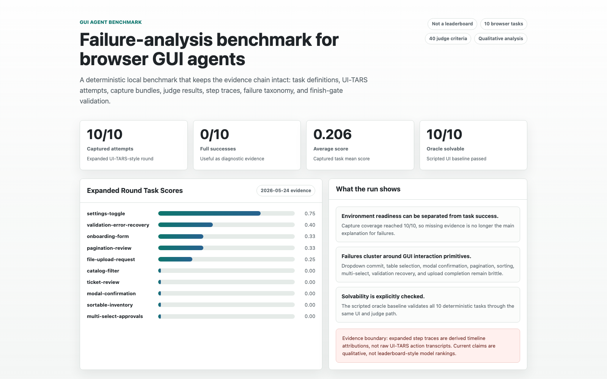

# GUI Agent Benchmark

[](https://github.com/Raidriar7170/gui-agent-benchmark/actions/workflows/validate.yml)
[](https://github.com/Raidriar7170/gui-agent-benchmark/releases)

[Live Dashboard](https://raidriar7170.github.io/gui-agent-benchmark/) ·
[Expanded Report](docs/benchmark-report-2026-05-25-expanded-real-round.md) ·
[Evidence Map](#evidence-map--证据地图) ·
[Run Locally](#run-locally--本地运行)

A deterministic browser benchmark for studying where GUI agents fail. The
workspace combines local tasks, judge APIs, UI-TARS capture helpers, target
preflight repair, step-trace attribution, and failure taxonomy artifacts.

一个用于分析 GUI Agent 失败原因的确定性浏览器评测工作区。它把本地任务、
judge API、UI-TARS 捕获流程、目标页 preflight 修复、step trace 归因和失败
taxonomy 串成一条可复核的证据链。

## TL;DR

This project builds a deterministic benchmark and evidence-chain harness for GUI
agents. The current expanded round captured all 10 planned UI-TARS-style browser
tasks, with 0 full successes and an average score of 0.206. That result is
diagnostic rather than leaderboard-style: it shows capture and environment
readiness are closed, while failures concentrate in GUI interaction primitives.

## Visual Overview / 可视化概览

[](https://raidriar7170.github.io/gui-agent-benchmark/)

Open the [public dashboard](https://raidriar7170.github.io/gui-agent-benchmark/)
or the [repo-local dashboard](docs/gui-agent-benchmark-dashboard.html) for a
skimmable view of the task scores, failure primitives, evidence chain, and
claim boundaries.

## 3-Minute Review Path / 三分钟评审路径

| Question | Where to look |
|---|---|
| What is this project? | A deterministic GUI-agent failure-analysis benchmark, not a UI-TARS leaderboard. |
| What is the core evidence? | 10 browser tasks, 40 judge criteria, 10/10 captured real UI-TARS attempts, 0/10 full successes, average score 0.206. |
| Are the tasks solvable? | The scripted oracle baseline validates 10/10 tasks through the same browser UI and judge path. |
| What did the real run show? | Failures cluster around dropdown commit, table/list selection, modal confirmation, pagination, sorting, multi-select submission, validation recovery, and upload flow completion. |
| What should not be overclaimed? | Expanded-round step traces are derived timeline attributions, not raw UI-TARS action transcripts. Current evidence supports qualitative failure analysis, not leaderboard or paper-grade statistical claims. |

Fast links:
[dashboard](https://raidriar7170.github.io/gui-agent-benchmark/),
[expanded report](docs/benchmark-report-2026-05-25-expanded-real-round.md),
[interview guide](docs/interview-project-introduction.html),
[oracle baseline](src/oracle-baseline.mjs),
[finish gate artifact](artifacts/finish-gate/2026-05-25-expanded-real-round.json),
[raw trace contract](docs/raw-uitars-trace-schema.md),
[release notes](https://github.com/Raidriar7170/gui-agent-benchmark/releases).

## Navigation / 导航

- [Visual Overview / 可视化概览](#visual-overview--可视化概览)
- [3-Minute Review Path / 三分钟评审路径](#3-minute-review-path--三分钟评审路径)
- [Project Positioning / 项目定位](#project-positioning--项目定位)
- [Goals / 目标](#goals--目标)
- [Evidence Boundary / 证据边界](#evidence-boundary--证据边界)
- [Current Results / 当前结果](#current-results--当前结果)
- [Run Locally / 本地运行](#run-locally--本地运行)
- [Evidence Map / 证据地图](#evidence-map--证据地图)

## Project Positioning / 项目定位

Most GUI-agent demos end at a final success or failure label. This project keeps
the evidence chain intact so failures can be separated into environment setup,
browser target binding, capture completeness, final judge state, and GUI
interaction primitives.

大多数 GUI Agent demo 只给出“成功/失败”的最终标签。这个项目更关心失败发生在
哪里：是环境没准备好、浏览器目标页绑定错误、capture 缺失、最终状态没有达到
judge 标准，还是模型没有完成某个具体 GUI 操作。

| This project is | This project is not |
|---|---|
| A reproducible GUI-agent benchmark harness | A UI-TARS leaderboard |
| A failure-analysis workspace with preserved artifacts | A claim that UI-TARS is generally weak |
| A deterministic local browser app with judge criteria | A paper-grade statistical benchmark yet |
| A way to compare capture, trace, and taxonomy evidence | A substitute for raw action-level telemetry |

## Goals / 目标

| Goal | 中文说明 |
|---|---|
| Keep runs reproducible | 用确定性任务和 judge criteria 避免“看起来像成功”的主观判断 |
| Preserve the full evidence chain | 为每个任务保留 capture、trace、summary、taxonomy 和 finish-gate 证据 |
| Explain primitive-level failures | 说明失败集中在哪些 GUI primitive，而不是只汇报 aggregate score |
| Avoid overclaiming | 当前证据用于 qualitative failure analysis，不用于 leaderboard 式结论 |

## Evidence Boundary / 证据边界

The expanded step traces are derived timeline attributions. They link preflight
reports, operator prompts, final capture state, benchmark evaluation, and the
finish gate, but they are not raw UI-TARS action transcripts.

Raw UI-TARS action-level logs, screenshots, browser private storage, and
model-internal logs were not captured for the expanded round. The current
evidence supports qualitative failure analysis, not leaderboard-style claims.
P0 is covered by the scripted oracle baseline; P1 defines the raw transcript
ingestion/capture contract. P2 now includes a strict native action evidence
sample for `settings-toggle`, `onboarding-form`, and `ticket-review`. These
samples preserve sanitized UI-TARS renderer transcript actions bounded by the
operator prompt and final capture/judge events, then validate them against
final capture output. Historical expanded-round step traces remain derived
timeline attributions; they are not presented as raw UI-TARS action
transcripts.

扩展轮次里的 step traces 是基于现有 artifact 重建的时间线归因，不是原始
UI-TARS action transcript。当前证据适合解释失败模式和 primitive 难点，但还
不足以做排行榜式模型能力结论。

## Current Results / 当前结果

Latest expanded round:
`experiments/2026-05-24-uitars-expanded-real-round/`

| Planned tasks | Captured tasks | Full successes | Average score |
|---:|---:|---:|---:|
| 10 | 10 | 0 | 0.206 |

The 0/10 full-success result is not presented as a leaderboard conclusion. It
is meaningful for diagnosing primitive-level failures because the expanded round
now has complete capture coverage, so missing evidence is no longer the primary
explanation for task failure.

Primary finding: capture completeness and environment readiness can be closed,
while task success remains limited by GUI interaction primitives such as
dropdown value commit, table selection, modal confirmation, pagination, sorting,
multi-select submission, validation recovery, and upload workflow completion.

核心结论：capture 完整性和环境 readiness 已经可以闭环，但任务成功率仍然受限于
具体 GUI interaction primitive，例如下拉框值提交、表格选择、modal 确认、分页、
排序、多选提交、validation recovery 和上传流程完成。

## Task Matrix / 任务矩阵

| Task | Score | Main failed primitive |
|---|---:|---|
| `onboarding-form` | 0.33 | Text-entry continuation and submit |
| `catalog-filter` | 0 | Filter/search to selected item commit |
| `settings-toggle` | 0.75 | Dropdown value commit |
| `ticket-review` | 0 | Table search, selection, and review commit |
| `modal-confirmation` | 0 | Modal open and confirm sequence |
| `pagination-review` | 0.33 | Page navigation and row action |
| `sortable-inventory` | 0 | Sort commit and row selection |
| `multi-select-approvals` | 0 | Multi-select and submit |
| `validation-error-recovery` | 0.4 | Validation recovery after error |
| `file-upload-request` | 0.25 | Upload form dropdown and submit |

The original 4-task failure patterns persisted in the expanded 10-task set:
text-entry stalls, dropdown commit misses, and search/table selection failures
all reappeared. The strongest partial success was simple boolean toggling in
`settings-toggle`.

原始 4 个任务中的失败模式延续到了扩展后的 10 个任务：文本输入中断、下拉框提交
失败、搜索/表格选择无法落到最终状态等问题仍然反复出现。目前最稳定的部分成功是
`settings-toggle` 里的简单布尔开关操作。

## Evidence Chain / 证据链

```text
deterministic task
  -> UI-TARS attempt
  -> preflight target check
  -> capture.json / trace.json / run-export.json
  -> real-run-summary.json
  -> step trace
  -> failure taxonomy
  -> finish gate
```

The design goal is to make every result auditable. A task is not treated as
closed just because a model run happened; the summary, capture bundle, taxonomy,
report, and finish gate need to agree.

设计目标是让每个结论都能回到 artifact 核验。一次模型运行本身不等于任务闭环；
只有 summary、capture bundle、taxonomy、report 和 finish gate 相互一致时，才把
这次结果当作可靠证据。

## Run Locally / 本地运行

This project is intentionally zero-dependency. Use Node.js 18 or newer.

```sh
npm run validate:oracle-baseline
npm run validate
npm run smoke
npm start
```

The local benchmark app defaults to:

```text
http://127.0.0.1:4173
```

The browser app exposes:

```js
window.__BENCH__ = {
  reset(taskId),
  snapshot(),
  evaluate(taskId),
  listTasks(),
  runs(),
  getRun(id),
  clearRuns(),
  exportRuns(),
  importRuns(payload)
}
```

See [docs/judge-protocol.md](docs/judge-protocol.md) for the judge schema.

## UI-TARS Integration / UI-TARS 集成

Real UI-TARS runs are optional and environment-specific. Do not commit private
connection details, deployment notes, credentials, browser storage, or raw model
logs.

真实 UI-TARS 运行是可选能力，并且依赖本地/远端环境。不要把私有连接信息、部署
细节、凭证、浏览器存储或原始模型日志写进提交内容。

Use local environment variables or local-only configuration for integration
runs. Keep public examples generic, and put setup guidance in
[docs/environment.md](docs/environment.md).

## Evidence Map / 证据地图

| Artifact | Purpose |
|---|---|
| [docs/benchmark-report-2026-05-25-expanded-real-round.md](docs/benchmark-report-2026-05-25-expanded-real-round.md) | Report narrative and primitive-level analysis |
| [experiments/2026-05-24-uitars-expanded-real-round/real-run-summary.json](experiments/2026-05-24-uitars-expanded-real-round/real-run-summary.json) | Machine-readable 10-task summary |
| [experiments/2026-05-24-uitars-expanded-real-round/failure-taxonomy.json](experiments/2026-05-24-uitars-expanded-real-round/failure-taxonomy.json) | Failure-code mapping with task evidence |
| `experiments/2026-05-24-uitars-expanded-real-round/step-traces/{task-id}.json` | Derived timeline attribution per task |
| `experiments/2026-05-24-uitars-expanded-real-round/tasks/{task-id}/real-run/` | Per-task capture bundle |
| [artifacts/finish-gate/2026-05-25-expanded-real-round.json](artifacts/finish-gate/2026-05-25-expanded-real-round.json) | Local plus integration readiness result |
| [src/oracle-baseline.mjs](src/oracle-baseline.mjs) and [scripts/validate-oracle-baseline.mjs](scripts/validate-oracle-baseline.mjs) | Scripted P0 oracle baseline proving task and judge solvability through UI actions |
| [docs/raw-uitars-trace-schema.md](docs/raw-uitars-trace-schema.md) | Raw UI-TARS trace schema plus P2 native action evidence exporter, analyzer, and strict gate commands |
| [experiments/2026-05-29-p2-native-action-evidence/summary.json](experiments/2026-05-29-p2-native-action-evidence/summary.json) | Strict P2 native UI-TARS action evidence for `settings-toggle`, `onboarding-form`, and `ticket-review` |

Per-task capture bundles contain:

```text
capture.json
trace.json
run-export.json
```

## Project Layout / 项目结构

```text
public/       browser benchmark UI and task definitions
src/          judge, run, preflight, trace, and finish-gate modules
scripts/      CLI runners and validators
docs/         reports, schemas, and setup notes
experiments/  captured benchmark rounds and evidence bundles
artifacts/    generated readiness reports
.github/      GitHub Actions validation workflow
```

## Trace Import / Trace 导入

The benchmark UI can import existing run exports and external trace payloads:

```json
{
  "traceVersion": 1,
  "source": "ui-tars",
  "taskId": "onboarding-form",
  "taskTitle": "Submit onboarding request",
  "startedAt": "2026-05-20T00:00:00.000Z",
  "events": [
    {
      "timestamp": "2026-05-20T00:00:01.000Z",
      "type": "input",
      "path": "form.fullName",
      "value": "Maya Ortiz"
    }
  ]
}
```

Supported formats:

- one trace object
- `{ "traces": [ ... ] }`
- JSONL where each non-empty line is one complete trace object
- existing `{ "runs": [ ... ] }` exports

## Next Steps / 下一步

1. P0: Keep the scripted browser oracle baseline green as tasks evolve; it
   proves all deterministic tasks are solvable through the same UI and judge
   path.
2. P1/P2: Preserve run-scoped native UI-TARS action-event traces for
   representative real runs. The first closure pack covers the original
   settings-toggle attempt plus two visible-target/screenshot-tool failure
   attempts with raw transcript events and capture/judge cross-checks.
3. P3: Fix visible-target binding so UI-TARS screenshots the prepared benchmark
   page instead of stale/search pages, then repeat the expanded 10-task round.
4. P4: Report repeated-round variance.
5. P5: Add a short GIF only if a future reviewer needs motion evidence beyond
   the static dashboard and preserved artifacts.

## Further Reading / 延伸阅读

- [Expanded real round report](docs/benchmark-report-2026-05-25-expanded-real-round.md)
- [Repeated baseline report](docs/benchmark-report-2026-05-24-repeated-baseline.md)
- [Failure taxonomy](docs/failure-taxonomy.md)
- [Step trace schema](docs/step-trace-schema.md)
- [Raw UI-TARS trace schema](docs/raw-uitars-trace-schema.md)
- [Environment setup](docs/environment.md)
